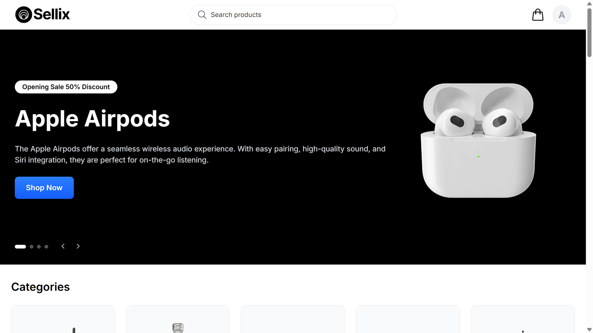
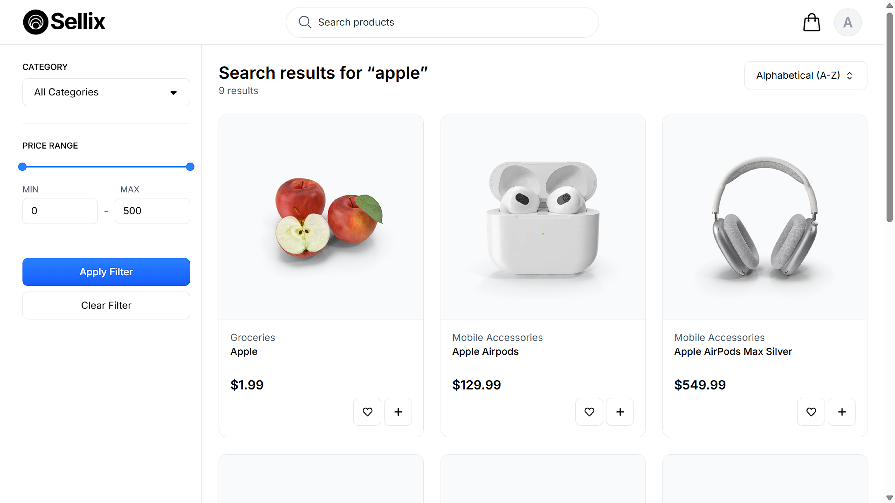
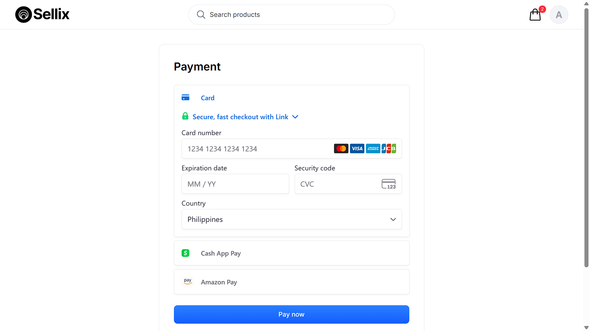
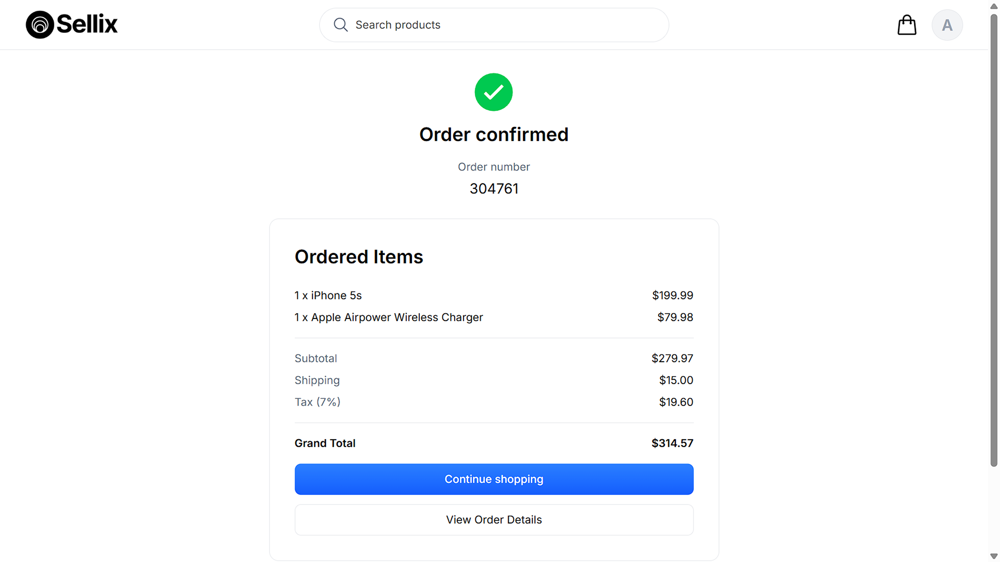

# Sellix — Modern Full-Stack E-Commerce Platform

Sellix is a production-grade e-commerce web application built to demonstrate real-world frontend and full-stack development skills.  
It focuses on performance, scalability, clean architecture, and polished user experience — the same constraints found in professional teams.

🔗 Live Demo: https://sellix-ecommerce.vercel.app/

---

## 📸 Preview







---

## 🧩 Key Features

- **Modern App Router architecture (Next.js 16)**
- **Server-side rendering & data fetching** for SEO and performance
- **Authentication & authorization** with NextAuth + Prisma
- **Full Stripe payment flow** (client + server integration)
- **Advanced product browsing**
    - Search
    - Category filtering
    - Sorting
    - Infinite scroll
- **Optimized UX**
    - Skeleton loaders
    - Delayed loading states to prevent flicker
    - Mobile-first responsive layout
- **Reusable component system**
- **Type-safe database access** with Prisma
- **Dockerized development setup**

---

## 🛠 Tech Stack

### Frontend

- **Next.js 16 (App Router)**
- **React 19**
- **TypeScript**
- **Tailwind CSS**
- **Radix UI**
- **Material UI (selective usage)**
- **Embla Carousel**

### Backend / Infrastructure

- **NextAuth** (authentication)
- **Prisma ORM**
- **PostgreSQL**
- **Stripe API**
- **Docker / Docker Compose**

### Developer Experience

- ESLint (strict)
- Type-safe environment
- Modular folder structure
- Prisma seeding
- Debounced search & optimized effects

---

## 🏗 Architecture Overview

- **App Router + Server Components** for scalable rendering
- **Client components only where interaction is required**
- **Clear separation of concerns**
    - `app/` — routing & layouts
    - `components/` — reusable UI
    - `lib/` — utilities, auth, prisma
    - `prisma/` — schema & seed data
- **Optimistic UX patterns** to avoid layout shift and flicker
- **State derived from URL params** for shareable, SEO-friendly pages

---

## 💳 Payments

- Secure Stripe checkout flow
- Client + server validation
- Production-ready payment architecture

---

## 🧪 Running Locally

### Prerequisites

- Node.js 20+
- Docker

### Setup

```bash
git clone https://github.com/your-username/sellix.git
cd sellix
npm install
```

---

## 👤 Author

Built by Jirald Calusay  
Web Developer focused on modern React, Next.js, and scalable frontend and backend systems.

- GitHub: https://github.com/JiraldLaurea
- LinkedIn: https://www.linkedin.com/in/jirald-calusay-064b09220/
- Portfolio: https://jiraldcalusay.vercel.app
- Email: jiraldcalusay@gmail.com
